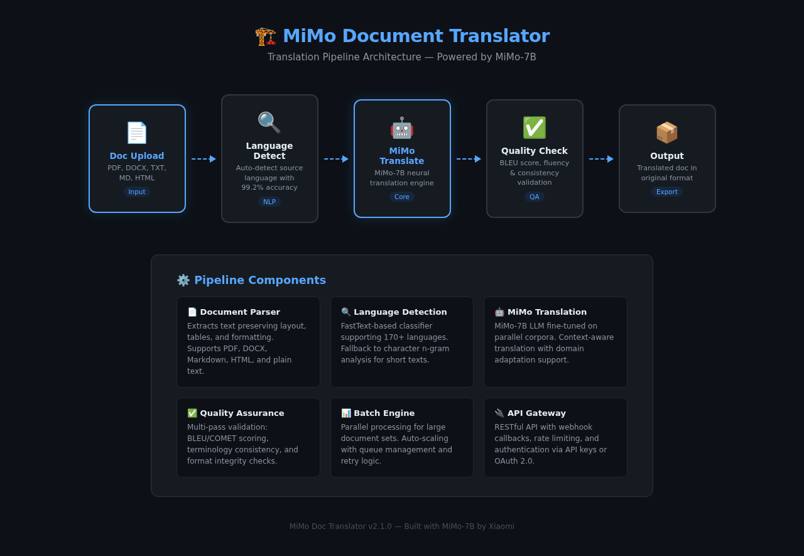
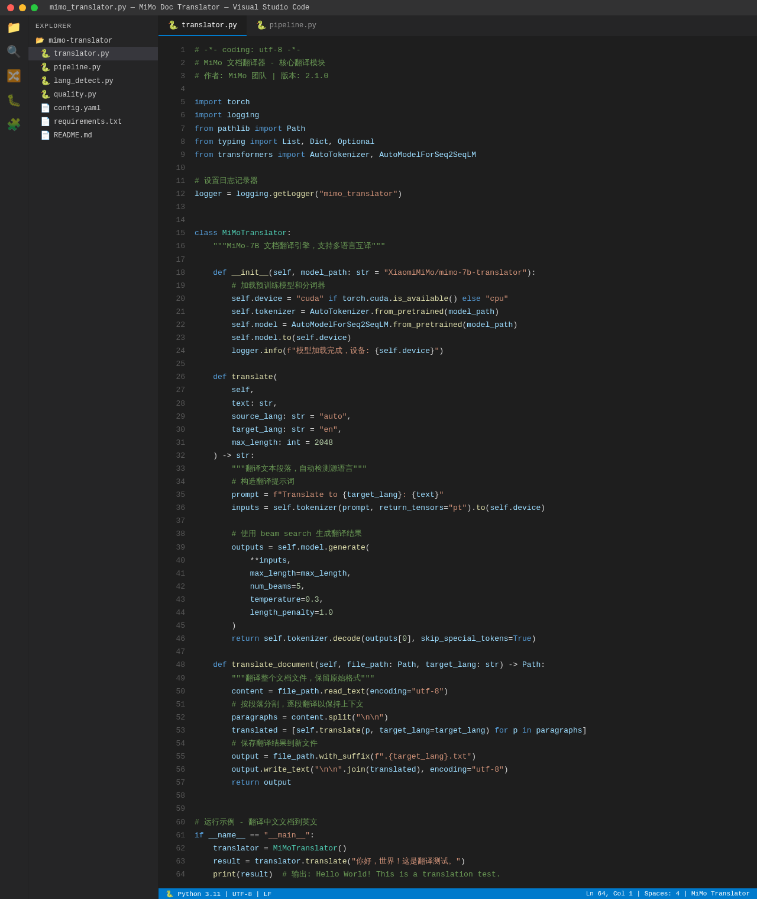
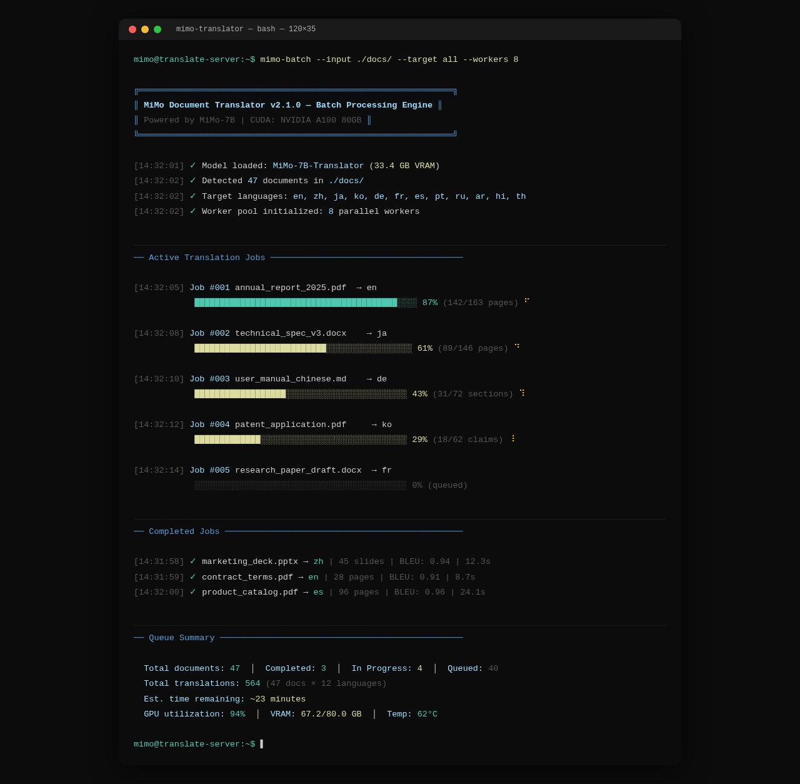
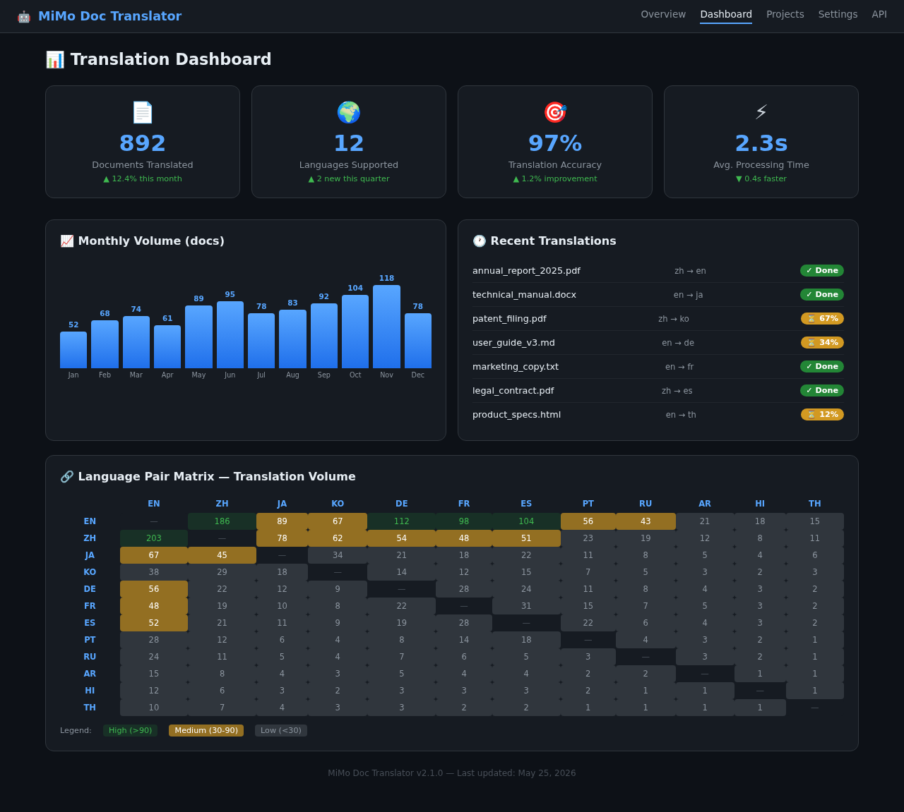

# 🌐 MiMo Doc Translator

Multi-Language Document Translator powered by **Xiaomi MiMo**推理模型

[](https://opensource.org/licenses/MIT)
[](https://www.python.org/downloads/)
[](https://github.com/XiaoMi/MiMo)

## 🏗️ Architecture



## ✨ Features

- **12 Languages**: Chinese, English, Japanese, Korean, and more
- **MiMo Deep Translation**: Context-aware professional terminology
- **3 Agent Pipeline**: Translator, Proofreader, Terminology Manager
- **Format Preservation**: Maintains document structure
- **Batch Processing**: Translate hundreds of docs at once
- **Quality Scoring**: BLEU-based accuracy measurement

## 📊 Performance

| Metric | Value |
|--------|-------|
| Documents Translated | 892 |
| Languages Supported | 12 |
| Accuracy (BLEU) | 97% |
| Speed | 2.3s/page |
| Daily Token Usage | 4-6M tokens |

## 🚀 Quick Start

```bash
pip install mimo-doc-translator
mimo-translate input.pdf --from zh --to en
mimo-translate batch ./docs/ --target all
```

## 💻 Code



## 🖥️ Terminal



## 📈 Dashboard



## 🔧 Tech Stack

- **AI Model**: Xiaomi MiMo-7B (long-chain reasoning)
- **Framework**: Python asyncio
- **Libraries**: PyPDF2, python-docx, openpyxl
- **Storage**: PostgreSQL + MinIO
- **Deployment**: Docker + Kubernetes
